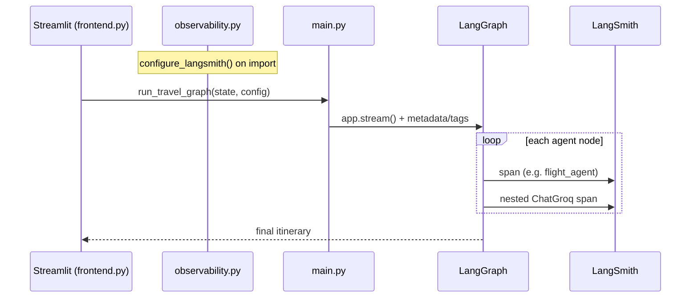

# LangSmith Observability for Voyager AI

This project traces LangGraph runs in [LangSmith](https://smith.langchain.com) using the official **Trace LangGraph applications** guide:

**Official docs:** https://docs.langchain.com/langsmith/trace-with-langgraph

Because Voyager AI uses **LangChain modules inside LangGraph** (`ChatGroq`, `SystemMessage`, etc.), tracing is enabled with environment variables only — no extra decorators are required for LLM calls.

---

## What gets traced

When tracing is on, each trip-planning run sends a trace to LangSmith showing:

- The top-level LangGraph run (`travel_planning`)
- Each graph node (`memory_load`, `flight_agent`, `hotel_agent`, `weather_agent`, `itinerary_agent`, `memory_save`)
- Nested `ChatGroq` LLM calls inside agents
- Metadata: `user_id`, `thread_id`, `app=voyager-ai`
- Tags: `voyager-ai`, `langgraph`, `user:<username>`, `streamlit`, `trip-planning`

## Trace flow

| Step | File | What happens |
|------|------|--------------|
| 1 | `observability.py` | Reads `.env`, sets `LANGSMITH_*` env vars at startup |
| 2 | `main.py` | `build_run_config()` attaches `metadata` + `tags` to each run |
| 3 | `frontend.py` | Shows LangSmith status in sidebar |
| 4 | LangGraph | Auto-emits spans for each node and nested LLM call |
| 5 | LangSmith UI | Filter by project, user tag, or thread_id |



Implementation files:

| File | Role |
|------|------|
| `observability.py` | Reads `.env`, sets LangSmith env vars, caches status |
| `main.py` | Calls `configure_langsmith()` at startup; `build_run_config()` adds metadata/tags |
| `frontend.py` | Calls `configure_langsmith()`; shows status in sidebar |

---

## 1. Install dependencies

```powershell
cd E:\Working\AI-Travel-Planning-App-using-LangGraph-and-MCP-main\Mcp-proj
pip install -r requirements.txt
```

`langsmith>=0.1.39` is included in `requirements.txt`.

---

## 2. Get a LangSmith API key

1. Sign up or log in at https://smith.langchain.com
2. Go to **Settings → API Keys**
3. Create a key and copy it

If your account is in **EU** or **APAC**, also set `LANGSMITH_ENDPOINT` (see [regional endpoints](https://docs.langchain.com/langsmith/trace-with-langgraph#2-configure-your-environment)).

---

## 3. Configure `.env`

Add these lines to your project `.env` (do **not** commit real keys):

```env
LANGSMITH_TRACING=true
LANGSMITH_API_KEY=lsv2_pt_...your_key...
LANGSMITH_PROJECT=voyager-ai-travel
LANGCHAIN_CALLBACKS_BACKGROUND=false
```

Optional:

```env
# LANGSMITH_ENDPOINT=https://eu.api.smith.langchain.com
# LANGSMITH_WORKSPACE_ID=your_workspace_id
```

`LANGCHAIN_CALLBACKS_BACKGROUND=false` is recommended for Streamlit because reruns are short-lived — traces flush before the script ends (per official LangSmith docs).

---

## 4. Verify configuration (CLI)

```powershell
python -c "from observability import get_langsmith_status; import json; print(json.dumps(get_langsmith_status(), indent=2))"
```

Expected when configured correctly:

```json
{
  "enabled": true,
  "project": "voyager-ai-travel",
  "endpoint": "https://api.smith.langchain.com",
  "reason": ""
}
```

If `enabled` is `false` and `reason` is `missing_api_key`, check `LANGSMITH_API_KEY` in `.env`.

---

## 5. Run the app and generate a trace

**Terminal 1 — Aviation MCP (if using flights):**

```powershell
cd aviationstack-mcp-main
uv sync
.\.venv\Scripts\python.exe -m aviationstack_mcp mcp run
```

**Terminal 2 — Streamlit UI:**

```powershell
cd E:\Working\AI-Travel-Planning-App-using-LangGraph-and-MCP-main\Mcp-proj
streamlit run frontend.py
```

1. Log in with any username
2. In the sidebar, confirm **LangSmith: enabled** and project name
3. Send a **new trip** message, e.g. `Plan a 3-day trip to Paris in December`
4. Wait for all agents to finish

**Alternative — CLI only (no Streamlit):**

```powershell
python main.py
```

Enter a username and travel request. This also produces a trace when LangSmith is enabled.

---

## 6. View traces in LangSmith

1. Open https://smith.langchain.com
2. Select project **`voyager-ai-travel`** (or your `LANGSMITH_PROJECT` value)
3. Open the latest run named **`travel_planning`**
4. Use **Details** view for the full graph tree (nodes + LLM children)
5. Use **Messages** view for a chat-style timeline

Filter tips:

- Filter by tag: `streamlit`, `trip-planning`, or `user:your_username`
- Filter by metadata: `user_id`, `thread_id`

---

## 7. Troubleshooting

| Symptom | Fix |
|---------|-----|
| Sidebar says "tracing off" | Set `LANGSMITH_TRACING=true` in `.env` and restart Streamlit |
| `missing_api_key` in status | Add `LANGSMITH_API_KEY` to `.env` |
| No traces in dashboard | Confirm project name matches `LANGSMITH_PROJECT`; wait ~10s and refresh |
| Auth / 401 errors | EU/APAC: set correct `LANGSMITH_ENDPOINT`; multi-workspace: set `LANGSMITH_WORKSPACE_ID` |
| Traces cut off mid-run | Keep `LANGCHAIN_CALLBACKS_BACKGROUND=false` for Streamlit |

---

## How it maps to official LangSmith docs

From https://docs.langchain.com/langsmith/trace-with-langgraph:

1. **Install** — `langsmith` in `requirements.txt`
2. **Configure environment** — `observability.configure_langsmith()` sets `LANGSMITH_TRACING`, `LANGSMITH_API_KEY`, `LANGSMITH_PROJECT`
3. **Log a trace** — `app.stream()` / `app.invoke()` with LangChain `ChatGroq` inside nodes; tracing is automatic
4. **Pass config** — `build_run_config()` supplies `metadata`, `run_name`, and `tags` on the LangGraph `config` dict (same pattern as the docs' `thread_id` example)

No `@traceable` decorators are needed unless you add custom non-LangChain SDK calls (e.g. raw `requests` or `openai` client) — see the "Without LangChain" section in the official docs if you add those later.
