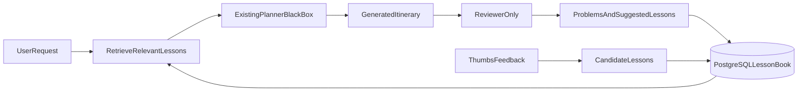

# Northline — Self-Improvement Loop

Northline improves through a controlled feedback and learning loop. It does not rewrite its own code or prompts.

## What happens (user workflow)

When you ask for a trip, Northline first loads your saved preferences from Mem0 and any proven lessons from the Lesson Book (only medium/high-confidence ones that match your destination and trip type). Those lessons are added as guidance before planning, but your explicit request in the current message still wins if there’s a conflict. The normal planner pipeline then runs unchanged and produces an itinerary. After that, a reviewer inspects the plan for problems like overloaded days or missing meals — it records findings and updates the Lesson Book, but it never rewrites what you see. You get the plan plus a read-only “Improvement audit” showing which lessons were used and what the reviewer found. If you give thumbs up, that’s logged as a positive signal. If you give thumbs down, you must leave a comment; that feedback is tied to the exact LangSmith trace, turned into a draft regression test for developers, and stored as a candidate lesson. After three similar negative reports, that lesson can promote and influence future trips.

## Why it works this way

The system is designed to improve safely, not by rewriting itself on the fly. The planner stays a black box so behavior stays predictable; learning happens around it through evidence-backed lessons instead of silent itinerary edits. New lessons start weak (1–2 observations), merge when similar, and only affect planning once they’ve been seen repeatedly — that stops one bad rating from permanently changing behavior. Thumbs-down feedback feeds two tracks: the Lesson Book learns patterns for future users, while draft eval cases and CI/nightly tests help developers fix real bugs in prompts, tools, or graph logic. Mem0 handles personal corrections (“I’m vegan”, “I prefer direct flights”); the Lesson Book handles reusable itinerary wisdom (“don’t pack more than five attractions per day”). Together, that gives you a loop where user feedback → stored evidence → better future plans, with human review still in control of code and test changes.

## User flow

1. A plan or AI follow-up completes.
2. The UI shows thumbs up/down.
3. Thumbs down requires a short comment.
4. Feedback is attached to the exact LangSmith trace.
5. The trace is analyzed and a likely component is suggested.
6. A draft regression test is written to `evals/datasets/proposed/`.
7. A developer reviews the draft before adding it to an approved golden dataset.

The scheduled collector is restricted to `northline-travel`, redacts common PII/secrets, and caches processed run IDs to avoid duplicate drafts.

## Evidence-backed Lesson Book

Northline now keeps a PostgreSQL-backed **Lesson Book** that learns from itinerary reviews and user feedback without changing the planner.



### Planning (before the unchanged planner)

- `retrieve_lessons` runs after memory retrieval and before `planner_agent`.
- Medium/high-confidence lessons are ranked by destination, category, confidence, and recency.
- Formatted lesson guidance is appended to `memory_context` so `planner_agent` stays unchanged.
- Explicit user requests in the current query still take priority over lesson guidance.

### Reviewer-only quality check (after generation)

- `quality_check` analyzes the finished itinerary but **never rewrites it**.
- The reviewer returns structured findings: `problem`, `reason`, `suggested_lesson`, `category`, and evidence metadata.
- Findings merge into existing lessons or create low-confidence lessons with mandatory evidence.
- The itinerary shown to the user is always the planner output.

### Confidence rules

| Observations | Confidence | Planning active |
|--------------|------------|-----------------|
| 1 | 0.20 (low) | No |
| 2 | 0.35 (low) | No |
| 3–5 | 0.65 (medium) | Yes |
| 6+ | 0.90 (high) | Yes |

Similar lessons in the same category are merged; evidence is append-only.

### Thumbs feedback → candidate lessons

- **Thumbs down + comment** creates or updates a candidate lesson tied to the LangSmith `run_id`, itinerary, and user request.
- **Thumbs up** records a positive improvement event but does not create a problem lesson.
- Candidates promote to active lessons after **3** similar observations (`PROMOTION_THRESHOLD`).
- LangSmith feedback and draft-golden proposal behavior are unchanged.

### Audit visibility

Streamlit shows a read-only **Improvement audit** section after each plan:

- lessons loaded for planning
- reviewer problems found
- lessons created or updated
- candidate lessons from feedback

Improvement events are also stored in PostgreSQL (`improvement_events`).

## What is automatic

| Step | Where to see it |
|------|-----------------|
| Feedback controls | Streamlit below each plan/follow-up |
| Lesson retrieval before planning | Streamlit improvement audit + graph state `lessons_loaded` |
| Reviewer findings (no rewrite) | Streamlit improvement audit + graph state `review_summary` |
| Full execution trace | LangSmith project `northline-travel` |
| Suggested failed component | Streamlit feedback confirmation + proposal JSON |
| Draft test case | `evals/datasets/proposed/*.json` |
| Scheduled collection | GitHub Actions → `Self-Improvement Evals` → artifact |
| Regression scores | `evals/results/*.md` |

## What requires review

- Moving a draft into `golden_ci.json`, `golden_nightly.json`, or `golden_memory.json`
- Changing agent prompts, graph logic, tools, memory, or guardrails
- Promoting or editing lesson-book entries beyond automated confidence rules
- Merging and releasing the fix

## Correction memory

Explicit corrections such as “Actually I am vegan” or “Remember that I prefer direct flights” are saved to Mem0 immediately and retrieved for later trips. The Lesson Book complements Mem0 with evidence-backed itinerary guidance.

## Key files

| Area | Files |
|------|-------|
| Lesson schema + repository | `backend/lessons/schema.py`, `backend/lessons/repository.py` |
| Confidence + merge policy | `backend/lessons/policy.py` |
| Reviewer (no rewrite) | `backend/lessons/reviewer.py`, `backend/graph/nodes/quality_check.py` |
| Lesson retrieval | `backend/graph/nodes/retrieve_lessons.py` |
| Service facade | `backend/lessons/service.py` |
| React audit + feedback | `frontend/src/` + `backend/app/routers/` |

## Commands

Collect all new negatively rated traces:

```powershell
python -m evals.helpers.trace_to_golden --collect-negative
```

Create a draft from one trace:

```powershell
python -m evals.helpers.trace_to_golden `
  --run-id YOUR_LANGSMITH_RUN_ID `
  --comment "The plan ignored my budget"
```

Run local checks:

```powershell
cd backend
python -m pytest evals/test_ci.py tests -q
```

## Required GitHub secrets

`GROQ_API_KEY`, `DATABASE_URL`, `MEM0_API_KEY`, `TAVILY_API_KEY`,
`AVIATIONSTACK_API_KEY`, `OPENWEATHER_API_KEY`, and `LANGSMITH_API_KEY`.
