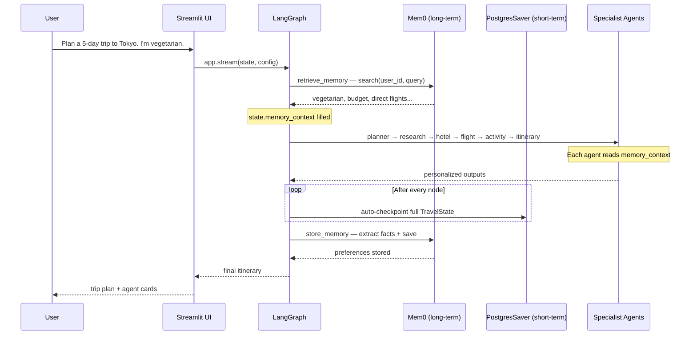
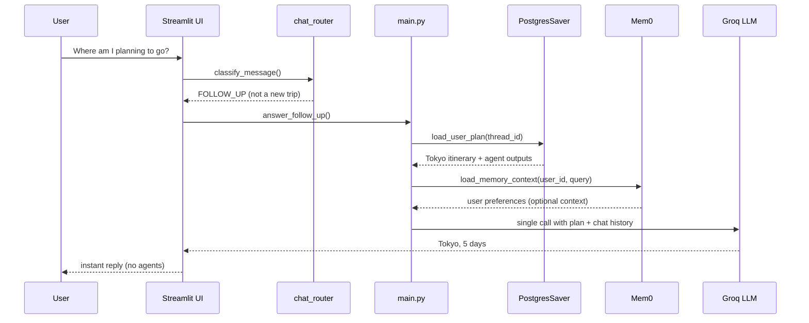

# Voyager AI — Memory Architecture (Interview Guide)

This document explains **how short-term and long-term memory work** in Voyager AI — at a high level, with enough detail to explain in an interview. For setup and testing, see [`docs/MEMORY.md`](../docs/MEMORY.md).

---

## The Big Picture in One Sentence

> **Short-term memory remembers the current trip (session). Long-term memory remembers the user (forever).**

We deliberately **do not mix** their responsibilities.

---

## Two Tiers at a Glance

| | Short-Term Memory | Long-Term Memory |
|---|-------------------|------------------|
| **Technology** | LangGraph `PostgresSaver` on Neon PostgreSQL | [Mem0](https://docs.mem0.ai/integrations/langgraph) Platform |
| **Key** | `thread_id` | `user_id` |
| **Scope** | One chat session | All sessions, all trips |
| **Stores** | Full graph state (itinerary, agent outputs, messages) | Durable user facts only |
| **Analogy** | Working memory — *what we're doing now* | User profile — *who this person is* |
| **Managed by** | LangGraph automatically | `MemoryManager` + Mem0 API |

---

## Identifiers — The Most Important Interview Point

```
One user  →  many conversations

user_id   = rahul
thread_id = rahul_chat        ← default session
thread_id = rahul_trip_tokyo  ← optional separate trip session
```

| Identifier | Used by | Example |
|------------|---------|---------|
| `user_id` | Mem0 | `rahul` — same across all trips |
| `thread_id` | PostgresSaver | `rahul_chat` — one conversation thread |

**Interview answer:** *"Mem0 is keyed by user because preferences like 'I'm vegetarian' apply to every trip. PostgresSaver is keyed by thread because the full itinerary belongs to one planning session."*

---

## What Gets Stored Where

### Short-term (PostgresSaver) — the full trip state

Saved **automatically after every graph node** — no manual save code needed.

- User query and messages
- Planner, research, hotel, flight, activity outputs
- Final itinerary
- Tool outputs, agent decisions, errors
- `memory_context` loaded for this run

**Not for:** cross-session user preferences.

### Long-term (Mem0) — durable facts only

**Store:**
- "I am vegetarian."
- "My budget is around $3000."
- "I always prefer direct flights."
- "I usually travel with my family."

**Do NOT store:**
- "Book a hotel in Paris" (one-off request)
- "Hello" / "Thanks" (not durable)
- "What's the weather?" (temporary question)

**Interview answer:** *"We use an LLM extraction step before saving to Mem0 so only durable preferences are persisted — not every chat message."*

---

## How Agents Receive Memory

Memory does **not** live inside each agent. It flows through **shared graph state**:

```
1. retrieve_memory node runs first
2. Mem0 returns relevant facts for user_id + query
3. Facts are formatted into state.memory_context
4. Every agent reads memory_context in its prompt
```

**Formatted prompt block injected into agents:**

```
Known User Information
- User is vegetarian
- Budget is around $3000
- Prefers direct flights
```

The planner naturally uses these when building the itinerary — hotels with vegetarian options, budget-aware suggestions, direct flight preference, etc.

**Small snippet — how config links session to memory:**

```python
config = {
    "configurable": {
        "thread_id": "rahul_chat",   # short-term key
        "user_id": "rahul",          # long-term key
    }
}
```

---

## Complete Flow — New Trip Planning



### Step-by-step (interview narrative)

1. **User sends a trip request** in Streamlit.
2. **`retrieve_memory` node** — queries Mem0 with `user_id` + latest message. Returns relevant past preferences.
3. **`memory_context`** is written into graph state before any agent runs.
4. **Agents run sequentially** — each reads `memory_context` and personalizes output.
5. **PostgresSaver** checkpoints the entire state after **every node** (crash-safe, resumable).
6. **`store_memory` node** — LLM extracts durable facts from the conversation, saves to Mem0.
7. **UI shows** the itinerary and agent detail cards.

---

## Complete Flow — Follow-Up Question

Follow-ups **do not re-run the full agent pipeline**. They use short-term checkpoint + optional Mem0 context.



**Interview answer:** *"Follow-ups are fast because we read the checkpointed plan from PostgresSaver and answer with one LLM call — we don't re-invoke MCP tools or the full graph."*

---

## Retrieve vs Save — When Each Happens

| Event | What runs | Memory tier |
|-------|-----------|-------------|
| New trip starts | `retrieve_memory` node | Mem0 **read** |
| Each agent finishes | LangGraph checkpoint | Postgres **write** |
| Itinerary complete | `store_memory` node | Mem0 **write** |
| Follow-up question | `load_user_plan()` | Postgres **read** |
| Follow-up question | `load_memory_context()` | Mem0 **read** (optional) |

---

## Architecture — Loose Coupling

```
┌─────────────────────────────────────────────────────┐
│                   LangGraph Graph                    │
│  retrieve_memory → agents... → store_memory          │
└────────────┬──────────────────────────┬─────────────┘
             │                          │
     ┌───────▼────────┐        ┌────────▼────────┐
     │ MemoryManager  │        │  PostgresSaver  │
     │   (facade)     │        │  (checkpointer) │
     └───────┬────────┘        └────────┬────────┘
             │                          │
     ┌───────▼────────┐        ┌────────▼────────┐
     │  Mem0Provider  │        │  Neon PostgreSQL │
     │ (MemoryClient) │        │  checkpoint tbls │
     └────────────────┘        └─────────────────┘
```

- **`MemoryManager`** — single entry point; agents never call Mem0 directly.
- **`Mem0Provider`** — implements a provider interface; Mem0 can be swapped without changing graph logic.
- **`PostgresSaver`** — built into LangGraph; no custom short-term code needed.

**Interview answer:** *"Memory is loosely coupled — graph nodes depend on MemoryManager, not Mem0 directly. We could replace Mem0 with another vector store by implementing the same provider interface."*

---

## Small Code Snippets (for interviews)

### 1. Graph compiled with short-term checkpointer

```python
checkpointer = PostgresSaver(pool)
app = graph.compile(checkpointer=checkpointer)
```

### 2. Mem0 retrieval (official pattern)

```python
memories = mem0.search(query, filters={"user_id": user_id})
context = "\n".join(f"- {m['memory']}" for m in memories["results"])
```

### 3. Agents read memory from state

```python
memory_context = state.get("memory_context", "")
prompt = f"{memory_context}\n\nUser trip request: {user_query}"
```

### 4. Memory extraction before save (our approach)

```python
# LLM decides what's worth storing permanently
facts = extractor.extract(user_message, assistant_response)
for fact in facts:
    mem0.add(fact, user_id=user_id)
```

---

## Error Handling

| Failure | Behavior |
|---------|----------|
| Mem0 unavailable | Log error, continue with empty `memory_context` — graph does not crash |
| Postgres unavailable | Checkpoint fails — short-term memory is required for session restore |

**Interview answer:** *"Long-term memory is best-effort — the app degrades gracefully. Short-term memory is required because follow-ups and session restore depend on it."*

---

## How to Demo in an Interview

### Demo 1 — Mem0 (long-term)

1. User `rahul`: *"I'm vegetarian, budget $3000, prefer direct flights. Plan Tokyo."*
2. Wait for plan + 15 seconds.
3. Same user, new message: *"Plan Bali"* (don't repeat preferences).
4. Show Bali plan mentions vegetarian + budget style.

### Demo 2 — Short-term (PostgresSaver)

1. Plan a trip to Paris.
2. Refresh browser.
3. Ask: *"Where am I planning to go?"*
4. Instant answer: Paris — no agent pipeline.

### Demo 3 — Mem0 dashboard

Open https://app.mem0.ai → show stored facts for `rahul`.

---

## Common Interview Questions & Answers

**Q: Why two memory systems instead of one?**  
A: They solve different problems. Session state is large and changes every message — PostgresSaver handles that natively in LangGraph. User preferences are small, semantic, and cross-session — Mem0 is built for that.

**Q: Why Mem0 instead of storing preferences in Postgres too?**  
A: Mem0 provides semantic search, fact extraction, and deduplication out of the box. We avoid maintaining our own embedding pipeline and pgvector tables.

**Q: What's the difference between `memory_context` and the checkpoint?**  
A: `memory_context` is a formatted text block from Mem0 for agent prompts. The checkpoint is the full structured `TravelState` object persisted by PostgresSaver.

**Q: When is memory retrieved?**  
A: At the start of every new trip (`retrieve_memory` node), and optionally during follow-ups via `load_memory_context()`.

**Q: When is memory saved?**  
A: Short-term: after every node automatically. Long-term: once at the end via `store_memory` after LLM extraction.

**Q: Can one user have multiple trips?**  
A: Yes. `user_id` is shared (Mem0 preferences apply to all). Each conversation can have its own `thread_id` (separate checkpoint per trip session).

---

## Related Docs

| Doc | Purpose |
|-----|---------|
| [`docs/MEMORY.md`](../docs/MEMORY.md) | Env setup, testing commands |
| [`README.md`](../README.md) | Full project overview |
| [Mem0 + LangGraph](https://docs.mem0.ai/integrations/langgraph) | Official Mem0 integration |
| [LangGraph persistence](https://docs.langchain.com/oss/python/langgraph/persistence) | PostgresSaver docs |
